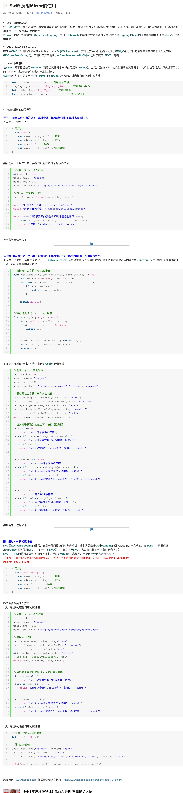

Swift 反射Mirror的使用

1，反射（Reflection）
对于C#、Java开发人员来说，肯定都对反射这个概念相当熟悉。所谓反射就是可以动态获取类型、成员信息，同时在运行时（而非编译时）可以动态调用任意方法、属性等行为的特性。
以Java上的两个知名框架（hibernate和spring）为例。hibernate的属性映射就是通过反射来赋值的，spring的bean的创建就是根据配置的class来反射构建的。

2，Objective-C 的 Runtime
在使用ObjC开发时很少强调其反射概念，因为ObjC的Runtime要比其他语言中的反射强大的多。在ObjC中可以很简单的实现字符串和类型的转换(NSClassFromString())，实现动态方法调用(performSelector: withObject:),动态赋值（KVC）等等。

3，Swift中的反射
在Swift中并不提倡使用Runtime，而是像其他语言一样使用反射(Reflect)。当然，目前Swift中的反射还没有其他语言中的反射功能强大，不仅远不及OC的Runtime，离Java的反射也有一定的距离。
Swift的反射机制是基于一个叫 Mirror 的 struct 来实现的，其内部有如下属性和方法：

let children: Children   //对象的子节点。
displayStyle: Mirror.DisplayStyle?   //对象的展示风格
let subjectType: Any.Type   //对象的类型
func superclassMirror() -> Mirror?   //对象父类的 mirror

4，Swift反射的使用样例

样例1：输出实体对象的类名，属性个数，以及所有属性的属性名和属性值。
首先定义一个用户类：

//用户类
class User {
    var name:String = ""  //姓名
    var nickname:String?  //昵称
    var age:Int?   //年龄
    var emails:[String]?  //邮件地址
}
接着创建一个用户对象，并通过反射获取这个对象的信息：
1
2
3
4
5
6
7
8
9
10
11
12
13
14
15
16
//创建一个User实例对象
let user1 = User()
user1.name = "hangge"
user1.age = 100
user1.emails = ["hangge@hangge.com","system@hangge.com"]
         
//将user对象进行反射
let hMirror = Mirror(reflecting: user1)
         
print("对象类型：\(hMirror.subjectType)")
print("对象子元素个数：\(hMirror.children.count)")
         
print("--- 对象子元素的属性名和属性值分别如下 ---")
for case let (label?, value) in hMirror.children {
    print("属性：\(label)     值：\(value)")
}
控制台输出信息如下：  
原文:Swift - 反射（Reflection）的介绍与使用样例（附KVC介绍）

样例2：通过属性名（字符串）获取对应的属性值，并对值做类型判断（包括是否为空）
首先为方便使用，这里定义两个方法。getValueByKey()是用来根据传入的属性名字符串来获取对象中对应的属性值。unwrap()是用来给可选类型拆包的（对于非可选类型则返回原值）

//根据属性名字符串获取属性值
func getValueByKey(obj:AnyObject, key: String) -> Any {
    let hMirror = Mirror(reflecting: obj)
    for case let (label?, value) in hMirror.children {
        if label == key {
            return unwrap(value)
        }
    }
    return NSNull()
}
 
//将可选类型（Optional）拆包
func unwrap(any:Any) -> Any {
    let mi = Mirror(reflecting: any)
    if mi.displayStyle != .Optional {
        return any
    }
     
    if mi.children.count == 0 { return any }
    let (_, some) = mi.children.first!
    return some
}
下面是实际测试样例，同样用上例的User对象做测试：

//创建一个User实例对象
let user1 = User()
user1.name = "hangge"
user1.age = 100
user1.emails = ["hangge@hangge.com","system@hangge.com"]
 
//通过属性名字符串获取对应的值
let name = getValueByKey(user1, key: "name")
let nickname = getValueByKey(user1, key: "nickname")
let age = getValueByKey(user1, key: "age")
let emails = getValueByKey(user1, key: "emails")
let tel = getValueByKey(user1, key: "tel")
print(name, nickname, age, emails, tel)
 
//当然对于获取到的值也可以进行类型判断
if name is NSNull {
    print("name这个属性不存在")
}else if (name as? AnyObject) == nil {
    print("name这个属性是个可选类型，且为nil")
}else if name is String {
    print("name这个属性String类型，其值为：\(name)")
}
 
if nickname is NSNull {
    print("nickname这个属性不存在")
}else if (nickname as? AnyObject) == nil {
    print("nickname这个属性是个可选类型，且为nil")
}else if nickname is String {
    print("nickname这个属性String类型，其值为：\(nickname)")
}
 
if tel is NSNull {
    print("tel这个属性不存在")
}else if (tel as? AnyObject) == nil {
    print("tel这个属性是个可选类型，且为nil")
}else if tel is String {
    print("tel这个属性String类型，其值为：\(tel)")
}
控制台输出信息如下：
原文:Swift - 反射（Reflection）的介绍与使用样例（附KVC介绍）

附：通过KVC访问属性值
KVC是key-value coding的缩写。它是一种间接访问对象的机制。其本质是依据OC中Runtime的强大动态能力来实现的。在Swift中，只要类继承NSObject即可使用KVC。（有一个叫KVO的，它又是基于KVC，大家有兴趣的可以自行研究下。）
KVC中：key的值就是属性名称的字符串，返回的value是任意类型，需要自己转化为需要的类型。
（注意：正由于KVC是基于Objective-C的，所以其不支持可选类型（optional）的属性，比如上例的 var age:Int? 
因此用户类做如下改造：）
1
2
3
4
5
6
7
//用户类
class User: NSObject{
    var name:String = ""  //姓名
    var nickname:String?  //昵称
    var age:Int = 0  //年龄
    var emails:[String]?  //邮件地址
}
KVC主要就是两个方法：
（1）通过key获得对应的属性值

//创建一个User实例对象
let user1 = User()
user1.name = "hangge"
user1.age = 100
user1.emails = ["hangge@hangge.com","system@hangge.com"]
 
//使用KVC取值
let name = user1.valueForKey("name")
let nickname = user1.valueForKey("nickname")
let age = user1.valueForKey("age")
let emails = user1.valueForKey("emails")
//let tel = user1.valueForKey("tel")
print(name, nickname, age, emails)
 
         
//当然对于获取到的值也可以进行类型判断
if name == nil {
    print("name这个属性是个可选类型，且为nil")
}else if name is String {
    print("name这个属性String类型，其值为：\(name)")
}
       
if nickname == nil {
    print("nickname这个属性是个可选类型，且为nil")
}else if nickname is String {
    print("nickname这个属性String类型，其值为：\(nickname)")
}
（2）通过key设置对应的属性值

//创建一个User实例对象
let user1 = User()
 
//使用KVC赋值
user1.setValue("hangge", forKey: "name")
user1.setValue(100, forKey: "age")
user1.setValue(["hangge@hangge.com","system@hangge.com"], forKey: "emails")
         
print(user1.name, user1.nickname, user1.age, user1.emails)

